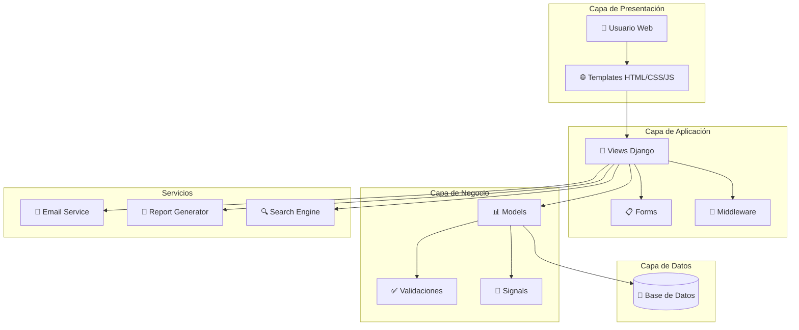

<div align="center">

# 🎓 UniCore - Sistema de Gestión Académica

### 🤖 Plataforma web moderna para gestionar carreras, cursos y estudiantes

[](https://www.djangoproject.com/)
[](https://www.python.org/)
[](LICENSE)
[](https://github.com/K1lluaZk)

[🌐 Ver Demo en Vivo](#) • [📝 Reportar Bug](https://github.com/K1lluaZk/UniCore/issues) • [✨ Solicitar Feature](https://github.com/K1lluaZk/UniCore/issues/new)

</div>

---

## 📖 Sobre el Proyecto

**UniCore** es una solución web integral diseñada para modernizar la gestión académica en instituciones educativas, combina una arquitectura robusta con una interfaz intuitiva para facilitar la administración de:

- 🎯 **Carreras** - Gestión completa de programas académicos
- 📚 **Cursos** - Administración de contenidos y horarios
- 👩‍🎓 **Estudiantes** - Registro y seguimiento del desempeño
- 👨‍💻 **Usuarios** - Sistema de roles y permisos
- 🏘️ **Grupos** - Organización de clases y secciones
- 👩‍🏫 **Profesores** - Gestión de docentes y asignaciones
- 📖 **Materias** - Planificación curricular

> 💡 **Proyecto Académico:** Implementa buenas prácticas de desarrollo web, patrones de diseño MVC, y principios de experiencia de usuario (UX/UI).

---

## ✨ Características Principales

### 🎨 Interfaz de Usuario

- ✅ **Diseño Responsivo** - Adaptable a dispositivos móviles, tablets y escritorio
- ✅ **Navegación Intuitiva** - Menús claros y acceso rápido a funcionalidades
- ✅ **Tema Moderno** - Paleta de colores consistente con modo claro
- ✅ **Iconografía** - Uso de FontAwesome y Bootstrap Icons
- ✅ **Animaciones Suaves** - Transiciones y feedback visual

### ⚡ Funcionalidades

#### Gestión de Datos
- ✅ **CRUD Completo** - Crear, leer, actualizar y eliminar registros
- ✅ **Validación de Formularios** - Validación en cliente y servidor
- ✅ **Búsqueda Avanzada** - Filtros y búsqueda en tiempo real
- ✅ **Paginación** - Manejo eficiente de grandes volúmenes de datos
- ✅ **Exportación** - Descarga de reportes en formato CSV/PDF

#### Administración
- ✅ **Panel de Administración** - Dashboard personalizado de Django
- ✅ **Control de Acceso** - Sistema de permisos por roles
- ✅ **Auditoría** - Registro de cambios y actividades
- ✅ **Notificaciones** - Alertas y mensajes del sistema
- ✅ **Respaldos** - Sistema de backup de base de datos

#### Reportes y Estadísticas
- ✅ **Dashboard Analítico** - Visualización de métricas clave
- ✅ **Reportes Personalizables** - Generación de informes académicos
- ✅ **Gráficos Interactivos** - Estadísticas visuales con Chart.js
- ✅ **Exportación de Datos** - Formatos múltiples (CSV, Excel, PDF)

---

## 🛠️ Stack Tecnológico

### Backend
```
🐍 Python 3.12          - Lenguaje principal
🎸 Django 6.0           - Framework web
🗄️ SQLite / PostgreSQL - Base de datos
🔐 Django Auth          - Sistema de autenticación
📧 Django Email         - Envío de correos
```

### Frontend
```
🌐 HTML5               - Estructura semántica
🎨 CSS3                - Estilos modernos con Flexbox/Grid
⚡ JavaScript ES6+     - Interactividad y validaciones
🎯 Tailwind CSS        - Framework de utilidades
📱 Bootstrap 5         - Componentes responsivos
🎭 FontAwesome 6       - Biblioteca de iconos
```

### Herramientas de Desarrollo
```
🔧 Git                 - Control de versiones
📦 pip                 - Gestor de paquetes Python
🐳 Docker (opcional)   - Contenedorización
🚀 Gunicorn            - Servidor de producción
```

---

## 🏗️ Arquitectura del Sistema



### Componentes Principales

1. **Modelos de Datos**
   - `Student` - Información de estudiantes
   - `Course` - Datos de cursos
   - `Career` - Programas académicos
   - `Enrollment` - Matrículas
   - `Teacher` - Profesores
   - `Subject` - Materias
   - `Group` - Grupos y secciones

2. **Vistas y Controladores**
   - Vistas basadas en clases (CBV)
   - Mixins para reutilización
   - Decoradores de permisos
   - API REST (opcional)

3. **Templates**
   - Sistema de herencia de plantillas
   - Componentes reutilizables
   - Internacionalización (i18n)

---

## 🚀 Instalación y Configuración

### Prerrequisitos

- Python 3.12 o superior
- pip (gestor de paquetes de Python)
- Git
- Virtualenv (recomendado)

### Opción 1: Instalación Local

#### 1️⃣ Clonar el Repositorio

```bash
git clone https://github.com/K1lluaZk/UniCore.git
cd UniCore
```

#### 2️⃣ Crear Entorno Virtual

**Windows:**
```bash
python -m venv venv
venv\Scripts\activate
```

**Linux/Mac:**
```bash
python3 -m venv venv
source venv/bin/activate
```

#### 3️⃣ Instalar Dependencias

```bash
pip install -r requirements.txt
```

#### 4️⃣ Configurar Variables de Entorno

```bash
cp .env.example .env
# Editar .env con tu configuración
```

Ejemplo de `.env`:
```env
SECRET_KEY=tu-clave-secreta-aqui
DEBUG=True
ALLOWED_HOSTS=localhost,127.0.0.1
DATABASE_URL=sqlite:///db.sqlite3
```

#### 5️⃣ Aplicar Migraciones

```bash
python manage.py makemigrations
python manage.py migrate
```

#### 6️⃣ Crear Superusuario

```bash
python manage.py createsuperuser
```

#### 7️⃣ Cargar Datos de Prueba (Opcional)

```bash
python manage.py loaddata fixtures/initial_data.json
```

#### 8️⃣ Ejecutar Servidor de Desarrollo

```bash
python manage.py runserver
```

#### 9️⃣ Acceder a la Aplicación

- **Sitio Principal:** http://127.0.0.1:8000/
- **Panel Admin:** http://127.0.0.1:8000/admin/

### Opción 2: Docker (Próximamente)

```bash
docker-compose up -d
```

---

## 📸 Capturas de Pantalla

<div align="center">

### 🏠 Página Principal


### 📊 Dashboard Administrativo


### 👩‍🎓 Gestión de Estudiantes


### 📚 Gestión de Cursos


</div>

---

## 🧪 Casos de Uso

### 📝 Ejemplo 1: Registrar un Nuevo Estudiante

```python
# En la vista o shell de Django
from AppAcademic.models import Student, Career

# Crear estudiante
student = Student.objects.create(
    first_name="Juan",
    last_name="Pérez",
    email="juan.perez@example.com",
    enrollment_date="2024-01-15",
    career=Career.objects.get(name="Ingeniería de Software")
)
```

### 📝 Ejemplo 2: Crear un Curso y Asignar Profesor

```python
from AppAcademic.models import Course, Teacher, Subject

# Crear curso
course = Course.objects.create(
    name="Programación Web Avanzada",
    code="CSC301",
    credits=4,
    subject=Subject.objects.get(name="Ciencias de la Computación"),
    teacher=Teacher.objects.get(email="profesor@itla.edu.do")
)
```

### 📝 Ejemplo 3: Matricular Estudiante en Curso

```python
from AppAcademic.models import Enrollment

# Crear matrícula
enrollment = Enrollment.objects.create(
    student=student,
    course=course,
    semester="2024-1",
    status="active"
)
```

## 🤝 Contribuir

¡Las contribuciones son bienvenidas! Si deseas mejorar este proyecto:

1. 🍴 Fork el proyecto
2. 🔨 Crea una rama para tu feature (`git checkout -b feature/AmazingFeature`)
3. 💾 Commit tus cambios (`git commit -m 'Add: nueva característica increíble'`)
4. 📤 Push a la rama (`git push origin feature/AmazingFeature`)
5. 🎯 Abre un Pull Request

### Convenciones de Commit

```
Add: nueva funcionalidad
Fix: corrección de bug
Update: actualización de código
Remove: eliminación de código
Docs: cambios en documentación
Style: formateo, espacios, etc.
Refactor: refactorización de código
Test: añadir pruebas
```

---

## 🗺️ Roadmap

- [x] Sistema de autenticación y roles
- [x] CRUD completo de módulos principales
- [x] Panel administrativo personalizado
- [x] Diseño responsivo
- [ ] Sistema de notificaciones en tiempo real
- [ ] API REST completa
- [ ] Aplicación móvil (React Native)
- [ ] Sistema de reportes avanzados
- [ ] Integración con sistemas externos
- [ ] Modo oscuro
- [ ] Soporte multiidioma completo
- [ ] Sistema de calificaciones en línea
- [ ] Chat en tiempo real

---

## 👥 Autores y Reconocimientos

<div align="center">

### Desarrollador Principal

<table>
  <tr>
    <td align="center">
      <a href="https://github.com/K1lluaZk">
        <br>
        <sub><b>Mario Suero</b></sub>
      </a><br>
      <sub>Estudiante ITLA</sub><br>
      <a href="https://github.com/K1lluaZk">GitHub</a>
    </td>
  </tr>
</table>

### Agradecimientos

- 👨‍🏫 Profesores y mentores del programa
- 🤝 Comunidad de Django
- 💚 Todos los contribuidores

</div>

---

## 📄 Licencia

Este proyecto está bajo la Licencia MIT - ver el archivo [LICENSE](LICENSE) para más detalles.

```
MIT License

Copyright (c) 2024 Mario Suero

Permission is hereby granted, free of charge, to any person obtaining a copy
of this software and associated documentation files (the "Software"), to deal
in the Software without restriction, including without limitation the rights
to use, copy, modify, merge, publish, distribute, sublicense, and/or sell
copies of the Software...
```

---

## 🌟 Muestra tu Apoyo

Si este proyecto te fue útil, ¡dale una ⭐ en GitHub!

[](https://github.com/K1lluaZk/UniCore/stargazers)
[](https://github.com/K1lluaZk/UniCore/network/members)

---

<div align="center">

### 💚 Hecho con amor en República Dominicana 🇩🇴

**[⬆ Volver arriba](#-unicore---sistema-de-gestión-académica)**

</div>
